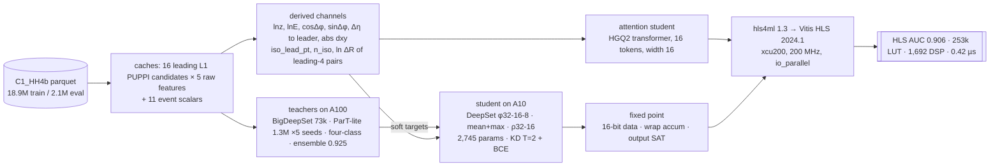

# Team fastml26-c1 — Challenge 1: HH→4b vs QCD / tt̄ / W+jets at the Level-1 trigger

> **TL;DR (2026-09-03, 21:30 PDT).** A **2,745-parameter DeepSet** student reaches **AUC 0.909** in float and **0.906 synthesized** on a Xilinx VU9P (`xcu200`) at **253k LUT / 1,692 DSP / 0.42 µs**, inside one SLR. The morning baseline was 0.883 at 319k LUT. The gains came from **physics inputs** (six derived per-candidate channels, +0.022), **fixed-point overflow handling** (16-bit closes once accumulators wrap wide and outputs saturate, −31 % LUT), and **distillation** from a 0.925 ParT-lite teacher ensemble. An **attention student** (HGQ2 transformer, 3k params) matches it in float and is being quantized. The scored metric is **tt̄-dominated** (official background mixture QCD 9 % / W+jets 36 % / tt̄ 55 %), and tt̄ is exactly where every remaining gain lives.

---

## 1. Headline numbers

| | float AUC | HLS AUC | vs QCD | vs tt̄ | vs W+jets | LUT | FF | DSP | latency | one SLR? |
|---|---|---|---|---|---|---|---|---|---|---|
| **Best FPGA design** — rich DeepSet student, 16-bit | 0.909 | **0.906** | 0.936 | 0.807 | 0.970 | **253,154** (72 %) | 176,866 | **1,692** (89 %) | 81–84 cyc = **0.42 µs** | ✅ |
| Morning baseline — plain student, 22-bit | 0.887 | 0.883 | 0.924 | 0.752 | 0.966 | 319,251 (91 %) | — | 1,724 (91 %) | 0.39 µs | ✅ |
| Best teacher (no FPGA constraint) | **0.925** | — | 0.947 | 0.850 | 0.977 | — | — | — | — | — |

Budget: one SLR of the VU9P ≈ 350k LUT / 700k FF / 1,900 DSP; latency ≤ 1 µs at 200 MHz. HLS numbers are Vitis HLS 2024.1 C-synthesis estimates via hls4ml 1.3 (`io_parallel`, reuse 1). Per-background HLS AUCs are on a 5,000-event closure sample; float AUCs on a 100k+100k eval slice.

## 2. How the number moved today

| step | float AUC | HLS AUC | LUT | DSP | what changed |
|---|---|---|---|---|---|
| baseline student, ap_fixed<22,10> | 0.887 | 0.883 | 319k | 1,724 | post-training quantization only |
| + saturation everywhere at 16 bit | 0.887 | 0.881 | 566k | 1,407 | closes, but saturation logic on every MAC is 2.6× the LUTs ❌ |
| + **targeted saturation** (wrap accumulators <24,12>, saturate only the 16-bit layer-output cast, per-layer weight integer bits) | 0.887 | 0.881 | **219k** | 1,411 | same AUC, −31 % LUT ✅ |
| + **six derived per-candidate channels**, mean+max pooling, 8 more event features, distillation | **0.909** | **0.906** | **253k** | **1,692** | +0.025 on hardware for +34k LUT ✅ **headline** |
| + tt̄-weighted distillation | 0.909 | 0.905 | 253k | 1,651 | −0.007 QCD / +0.007 tt̄: better on the official mixture (see §6) |
| attention student (float) | 0.909–0.913 | pending | — | — | HGQ2 transformer, 3–5k params; quantized synthesis running |

## 3. Pipeline

## 4. The dataset, counted (this matters for the score)

| split | HH→4b | QCD (HT>250) | W+jets → ℓν | W+jets → qq | tt̄ hadronic | tt̄ semi-leptonic | tt̄ leptonic | total |
|---|---|---|---|---|---|---|---|---|
| train | 9,003,474 | 902,592 | 1,803,017 | 1,805,576 | 1,803,430 | 1,801,364 | 1,801,374 | 18,920,827 |
| eval | 1,000,384 | 100,482 | 200,281 | 200,531 | 200,327 | 200,110 | 200,111 | 2,102,226 |

Background mixture in **both** splits: **QCD 9 % · W+jets 36 % · tt̄ 55 %** (tt̄ decay modes 1/3 each). Our development eval slice used even thirds; since a pooled AUC is the background-fraction-weighted mean of the per-background AUCs, the official number is tt̄-dominated (§6). Inputs per event: the 16 leading-pT L1 PUPPI candidates × (pT, η, φ, dxy) plus 11 event scalars (HT, leading pTs, n_cand, dxy sums, m2, m4). No generator-level truth in the files (`physics/COLUMNS.md`).

## 5. Every model, with per-background AUC

### 5a. Teachers (Purdue AF A100, agent `hh4b`; eval slice 100k HH + 100k background, even thirds)

| model | head | architecture | params | AUC | vs QCD | vs tt̄ | vs W+jets | note |
|---|---|---|---|---|---|---|---|---|
| `ds_big_s0` | binary | BigDeepSet φ128-64-32, mean+max, ρ256-128-64, derived feats | 72,717 | 0.9151 | 0.9436 | 0.8261 | 0.9757 | first soft targets |
| `part_s0` / `part_s1` | binary | ParT-lite: width 128, 8 heads, pairwise attention bias (ln ΔR, ln kT, ln z, ln m²) | 1,334,013 | 0.9239 / 0.9239 | 0.9454 | 0.8504 | 0.9759 | 50 epochs |
| `part_e25_s2` / `part_e25_d20_s3` | binary | same, 25 epochs, dropout 0.15 / 0.2 | 1,334,013 | 0.9236 / 0.9236 | 0.9453 | 0.8500 | 0.9756 | |
| `part_b4k_s6` | binary | same, batch 4k | 1,334,013 | 0.9234 | 0.9453 | 0.8490 | 0.9759 | |
| **`part4c_s0`** | **four-class** | same trunk, softmax over HH/QCD/tt̄/W | 1,334,208 | **0.9246** | **0.9468** | **0.8511** | 0.9759 | best single model |
| `ens_part2` | binary | mean logit of 2 seeds | 2,668,026 | 0.9245 | 0.9460 | 0.8513 | 0.9762 | |
| **`ens_part4`** | binary | mean logit of 4 ParT seeds | 5,336,052 | **0.9248** | 0.9464 | 0.8518 | 0.9762 | **published soft targets** (`soft_targets_*.npy`) |
| `ens_part4_ds` | binary | 4 ParT seeds + DeepSet | 5,408,769 | 0.9247 | 0.9471 | 0.8501 | 0.9768 | **not** published — see below |
| **`ens_part4_4c`** | mixed | 4 ParT seeds + `part4c_s0` | 5,336,052 | **0.9251** | 0.9468 | **0.8522** | 0.9763 | best overall; logits on disk, not yet published |

Five independent ParT-lite runs agree to ±0.0005 → the 16-candidate inputs cap the teacher near **0.925**. tt̄ is the only hard background.

Two corrections to an earlier version of this table. **The published soft targets are `ens_part4`, not
`ens_part4_ds`**: adding the DeepSet to the ensemble buys QCD and W+jets but costs 0.0017 vs tt̄, which
nets −0.0001 on even thirds and **−0.0007 on the official 9/36/55 mixture**, where tt̄ carries 55 % of the
background. It was measured and rejected, not published. And the best teacher is `ens_part4_4c` at
**0.9251** (official 0.9054); its logits are in `team/teacher/runs/ens_part4_4c/`, deliberately not swapped
into `soft_targets_*.npy` while the c3/c1 distillation jobs are reading those files.

On the official mixture (§6) the teachers rank: `ens_part4_4c` 0.9054 · `ens_part4` 0.9051 ·
`part4c_s0` 0.9047 · `ens_part4_ds` 0.9045 · `part_s0` 0.9042 · `ds_big_s0` 0.8905.

### 5b. Students, float (pod A10, agents `c1` / `c3`; same eval slice)

| model | lane | architecture | inputs | params | training | AUC | vs QCD | vs tt̄ | vs W+jets |
|---|---|---|---|---|---|---|---|---|---|
| `B1e_16p_1M` = `model_2041` | c1 | DeepSet φ32-16-8, mean pool, concat, ρ32-16 | 16×5 + 11 evt | 2,041 | 2M events, BCE | 0.8869 | 0.9303 | 0.7587 | 0.9716 |
| `kd_T2_a07` | c1 | same | same | 2,057 | KD from `ds_big_s0` | 0.8900 | — | 0.767 | — |
| `c2_canon` (CPU, 600k ev) | c2 | same net, canonical inputs | 16×11 + 19 evt | ~2.7k | BCE | 0.9010 | 0.9339 | 0.7961 | 0.9729 |
| **`rkd_T2_a05` = `model_2777_rich`** | c1 | φ32-16-8 over 11 channels, mean+max, ρ32-16 | 16×11 + 19 evt | 2,745 | KD T=2 α=0.5 from `ds_big_s0` | **0.9090** | ~0.935 | 0.8119 | ~0.974 |
| `pkd_T2_a07` | c1 | same | same | 2,745 | KD from `ens_part4` | 0.9087 | — | 0.8137 | — |
| `rich_1M_w2dis` = `model_2777_rich_tt` | c1 | same | same | 2,745 | KD, tt̄ ×2 + disagreement weighting | 0.9086 | 0.928* | 0.814* | 0.967* |
| `qat_b1e-6` | c1 | same, HGQ2 QAT (360k EBOPs) | same | 2,745 | 12 ep, β₀ 1e-6 | 0.8904 | — | — | — |
| attention w8 | c3 | HGQ2 transformer, 1 block, 1 head | 16×5 + 11 evt | 1,129 | KD | 0.8965 | 0.932 | 0.787 | 0.971 |
| attention w16 | c3 | 1 block, 1 head | same | 3,073 | KD | 0.9082 | 0.940 | 0.810 | 0.974 |
| **attention w16, 2 heads** | c3 | 1 block, 2 heads | same | 3,073 | KD | **0.9086** | 0.940 | 0.814 | 0.973 |
| attention w16, 2 blocks | c3 | 2 blocks | same | 5,233 | KD | 0.9114 | 0.942 | 0.817 | 0.975 |
| attention w32 | c3 | 1 block | same | 10,033 | KD | 0.9127 | 0.943 | 0.820 | 0.975 |

\* HLS-sample values. The 11 particle channels: log_pt, η, dxy, cos φ, sin φ + derived lnz, lnE, cos Δφ_lead, sin Δφ_lead, Δη_lead, |dxy|. The 19 event features: the 11 originals + iso_lead_pt, n_iso, ln ΔR of the 6 leading-4 pairs. Firmware cost of every derived feature: `fpga/FEATURES.md`.

### 5c. Loss-shaping experiments on tt̄ (c1, rich student, 300k screening cache)

| loss | overall | vs QCD | vs tt̄ | vs W+jets | verdict |
|---|---|---|---|---|---|
| baseline KD | 0.9040 | 0.9363 | 0.8028 | 0.9729 | |
| tt̄ ×2 in the hard term | 0.9041 | 0.9335 | 0.8068 | 0.9720 | zero-sum on even thirds |
| tt̄ ×3 | 0.9029 | 0.9300 | 0.8095 | 0.9693 | net loss on even thirds |
| disagreement-weighted KD (1 + \|z_T − z_S\|/mean) | 0.9048 | 0.9362 | 0.8054 | 0.9728 | free gain |
| **tt̄ ×2 + disagreement** | **0.9049** | 0.9344 | **0.8090** | 0.9713 | promoted → `model_2777_rich_tt` |

Also measured: a teacher +0.0096 better (`ens_part4` vs `ds_big_s0`) moved the student by −0.0003 → **capacity-limited, not supervision-limited**.

### 5d. FPGA designs (hls4ml 1.3 → Vitis HLS 2024.1, xcu200 VU9P, 200 MHz, io_parallel, reuse 1)

| design | float (sample) | **HLS AUC** | HLS QCD | HLS tt̄ | HLS W+jets | LUT | FF | DSP | latency | one SLR (350k LUT / 1,900 DSP)? |
|---|---|---|---|---|---|---|---|---|---|---|
| `model_2041` @ ap_fixed<22,10> wrap | 0.8847 | 0.8830 | 0.9242 | 0.7521 | 0.9658 | 319,251 | — | 1,724 | 75–78 cyc, 0.39 µs | ✅ 91 % |
| `model_2041` @ <20,10> wrap | 0.8847 | 0.8708 | — | — | — | 268,087 | 223,809 | 1,468 | 0.37 µs | ✅ 77 %, −0.014 AUC |
| `model_2041` @ <16,6> wrap | 0.8847 | 0.807 | — | — | — | — | — | — | — | ❌ overflow wraps |
| `model_2041` @ <16,6> saturate everywhere | 0.8847 | 0.8809 | — | — | — | 566,173 | 216,503 | 1,407 | 0.58 µs | ❌ 162 % LUT |
| `model_2041` @ <18,8> saturate everywhere | 0.8847 | 0.8829 | — | — | — | 628,259 | 262,193 | 1,476 | 0.59 µs | ❌ |
| `model_2041` **`tsat_16_6`** | 0.8847 | 0.8815 | 0.9207 | 0.7533 | 0.9635 | 219,316 | 149,434 | 1,411 | 0.39 µs | ✅ 63 % |
| **`model_2777_rich` `tsat_16_6`** | 0.9077 | **0.9062** | **0.9356** | 0.8074 | **0.9703** | **253,154** | 176,866 | **1,692** | **0.42 µs** | ✅ **72 % / 89 %** |
| `model_2777_rich` @ <22,10> wrap | 0.9077 | 0.9069 | — | — | — | 369,990 | 353,572 | 2,322 | 0.43 µs | ❌ 106 % / 122 % |
| `model_2777_rich_tt` `tsat_16_6` | 0.9073 | 0.9048 | 0.9281 | **0.8141** | 0.9674 | 252,894 | 176,373 | 1,651 | 0.42 µs | ✅ |
| distributed arithmetic (da4ml) variants | | | | | | | | | | Vitis running |
| HGQ2 students (`qat_*`, attention) | | | | | | | | | | project tarballs → Vitis |

`tsat_16_6` = 16-bit data types, `ap_fixed<24,12>` wrap accumulators, `ap_fixed<16,6,AP_RND,AP_SAT>` only at each layer's output cast, per-layer weight integer bits from max|W|. Not yet counted: the preprocessing block that derives the 6 extra channels per candidate.

## 6. What the score will actually be

Pooled AUC over the official mixture = 0.09·AUC_QCD + 0.36·AUC_W + 0.55·AUC_tt̄:

| design | even-thirds HLS AUC | **official-mixture AUC** |
|---|---|---|
| `model_2041` `tsat_16_6` | 0.8815 | 0.844 |
| `model_2777_rich` `tsat_16_6` | 0.9062 | 0.878 |
| **`model_2777_rich_tt` `tsat_16_6`** | 0.9048 | **0.880** |
| best teacher (float, not FPGA) | 0.9247 | 0.897 |

So tt̄ carries 55 % of the weight, the tt̄-weighted student is the better submission, and models are now selected on this number.

## 7. Findings, in order of importance

1. **Inputs beat teachers.** Six derived per-candidate channels + isolation + leading-4 pairwise ln ΔR: +0.022 AUC, +0.05 on tt̄, for +34k LUT. A 0.01-better teacher: +0.0003 on the student.
2. **tt̄ is the whole game.** Every model separates W+jets at 0.97 and QCD at 0.93–0.95. The student–teacher gap (0.81 vs 0.85) is entirely tt̄, and fully hadronic tt̄ (six jets, two real b hadrons) is the hard part (0.72 alone).
3. **16-bit fixed point works once overflow is handled.** Wrap accumulators wide, saturate at the output cast; saturating every MAC costs 2.6× the LUTs. Fixed-point loss ≤ 0.006 on any background.
4. **The teacher ceiling is the data.** Five ParT-lite runs within ±0.0005 of 0.924; the ensemble adds 0.001; a four-class head adds 0.0007.
5. **Loss shaping:** disagreement weighting is a free +0.001; tt̄ up-weighting only moves the operating point — which is the right move on the official mixture.
6. **Attention fits the parameter budget:** a 3k-param HGQ2 transformer ties the rich DeepSet in float; hardware cost pending.
7. **Dead ends (measured):** cross-layer equalization (function-preserving, no fixed-point benefit), ln z pair feature (worth 0), a full O(N²) pairwise block in the DeepSet, dijet Higgs pairing, generator-truth (privileged) distillation (no truth columns).

## 8. Running now / next

- `c1`: four-class student head; HGQ2 QAT with gentler bit-width penalty (β₀ 1e-7, 30 epochs, KD on); official-mixture training; 4M-event retrain.
- `c2`: W-mass / top-mass features for hadronic tt̄; dxy order statistics; feature firmware costs; train4M cache (done, 5.6 GB).
- `c3`: quantized attention students → hls4ml project tarballs → Vitis.
- `hh4b` (A100): four-class soft targets, extra ensemble seeds, train4M teacher, and the shared job queue `A100_QUEUE.md`.
- orchestrator: Vitis synthesis of every export (automatic), distributed-arithmetic variants, per-feature preprocessing cost, the slide.

## 9. Repo map

`RESULTS.md` (all training results) · `fpga/RESULTS-fpga.md` (all synthesis results, closure, per-background HLS AUC) · `fpga/reports/*.json` (Vitis summaries) · `fpga/FEATURES.md` (firmware cost per feature) · `fpga/FIXED-POINT.md` (overflow diagnosis) · `IDEAS.md` (literature scan + skeptic verdicts) · `NEXT.md` · `A100_QUEUE.md` · `physics/` (tt̄ study, `COLUMNS.md`) · `teacher/` (teacher code + soft targets) · `attn/` (attention student) · `export/` (student exports: json + weights + eval samples) · `data.py`, `models.py`, `train.py`, `distill.py`.

Lanes are autonomous Claude Code agents: `c1` student training (pod A10), `c2` physics/features (CPU), `c3` attention student (pod A10), `hh4b` teachers (Purdue AF A100); synthesis on a 96-core box with Vitis HLS 2024.1. No line of this repo was written by hand.

---

# Team workflow — FastML26 Challenge 1 (HH→4b vs QCD, trigger level)

Everything is done by Claude Code agents; humans decide, agents execute.

## The scoreboard
`team/RESULTS.md` is the single source of truth and Friday's slide. Append one row
per experiment; never edit others' rows.

| model | params | AUC (eval) | train events | quant | LUT | FF | DSP | BRAM | latency | notes |

## Conventions
- One branch per person (`<name>/...`), merge to `main` via PR when a row lands in RESULTS.md.
- Scripts live in `team/`: `data.py` (streaming parquet loader, capped events), `models.py`,
  `train.py`. Reuse them; don't fork the loader.
- Never load the full 132 GB. `data.py` caps events per process.
- Commit + push after every milestone: pods restart.

## The two halves of the score
1. **AUC** of the network score, HH_4b vs all backgrounds (QCD, tt, W+jets).
2. **FPGA feasibility**: hls4ml/Vitis HLS estimate for Xilinx VU9P (`xcu200-fsgd2104-2-e`),
   latency ≤ 1 µs, fits ONE SLR (~350k LUT, 700k FF, 1,900 DSP, 25.3 MB BRAM).
   Synthesis runs on Vitis HLS 2024.1 (COS-6PRIME) from an exported model; the pod
   does training + quantization-aware training (QKeras) in `~/hlsenv`.

## Division of labour (proposed)
- physics features: pairwise masses / jet-like clustering of the 16 PUPPI candidates, dxy as a b-proxy
- model-size sweep: DeepSet & MLP widths, AUC-vs-params curve
- quantization + synthesis: QKeras QAT, hls4ml config, Vitis report
